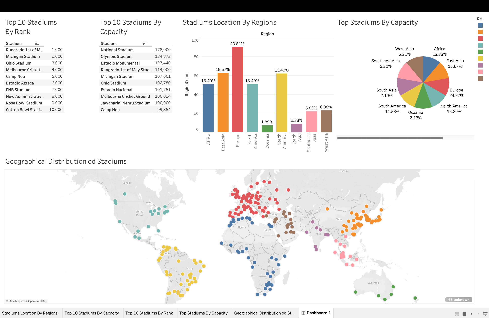

### A Data Engineering pipeline for football data analytics

This project is an end-to-end ETL pipeline to extract and analyze global football stadium data, enabling comprehensive analytics and insights.

Detailed metrics and visual analytics reports through Power BI to identify key trends and insights, supporting data-driven decision-making.
